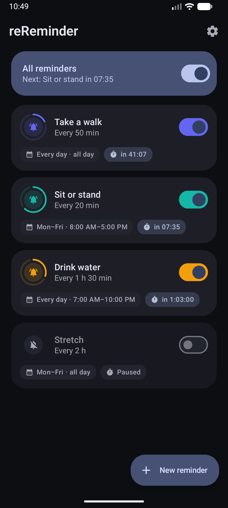
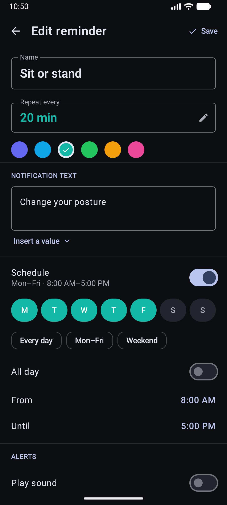

<div align="center">

<!-- LOGO SECTION (Replace logo.png with your actual icon path if you have one, or remove the line) -->


# reReminder

**The Loop that keeps you in the Loop.**

A powerful, open-source Android application for recurring reminders.  
Perfect for workouts, medication, hydration, productivity techniques (Pomodoro), or simply keeping track of time.

<!-- BADGES START -->
[](https://github.com/ProfessorQuantumUniverse/reReminder/releases)
[](LICENSE)
[](https://www.android.com/)
[](https://github.com/ProfessorQuantumUniverse/reReminder)


<!-- BADGES END -->

<br />

<!-- DOWNLOAD BUTTONS START -->
<a href='https://play.google.com/store/apps/details?id=com.olaf.rereminder'>
  
</a>
<a href='https://f-droid.org/de/packages/com.olaf.rereminder/'>
  
</a>
<br />
<a href="https://github.com/ProfessorQuantumUniverse/reReminder/releases/latest">
  
</a>
<!-- DOWNLOAD BUTTONS END -->

</div>

> [!CAUTION]
> ## Keep Android Open
> Android FOSS is under threat. From 2026/2027 onward, Google will require developer verification for all Android apps on certified devices, including those installed outside of the Play Store. If you care about the freedom to control your devices and care about the privacy of you data, please contact your representative and make your voice heard. To know about it more go to https://keepandroidopen.org/

---

## 🚀 Overview

**reReminder** is designed for one simple purpose: **Reliability**. Whether you need a chime every 5 minutes to correct your posture, a vibration to sip water, or a voice telling you the time, reReminder handles it without draining your battery or invading your privacy.

It runs in the background, wakes up exactly when it needs to, and goes back to sleep. Simple.

Since **3.0** you are no longer limited to a single reminder: run as many independent loops as you like, each with its own interval, schedule and message.

## ✨ Key Features

### Multiple reminders
*   **♾️ As many loops as you need:** "Take a walk" every 50 minutes and "Sit or stand" every 20 minutes run side by side, each counting down independently.
*   **🎨 Colour coded:** Give every reminder its own accent so the list stays readable at a glance.
*   **⏯️ Master switch:** Pause everything with one toggle — and see which reminder is up next and when — without losing each reminder's individual state.

### Schedules
*   **📅 Pick your days:** Run a reminder only Mon–Fri, only on weekends, or on any combination of weekdays.
*   **🕘 Pick your hours:** Restrict a reminder to a time window like 08:00–17:00. Windows may cross midnight (22:00–06:00) for night shifts.
*   **😌 Off by default:** A new reminder simply runs at any time. The schedule is one switch away when you want it, and invisible when you don't.

### Notifications
*   **✍️ Dynamic text:** Insert values that are filled in the moment the reminder fires — `{time}`, `{date}`, `{day}`, `{name}`, `{interval}` and `{next}` — with a live preview while you type.
*   **🗣️ Text-to-Speech (TTS):** Let the app *speak* your message so you don't have to look at your phone. It follows your device language.
*   **📳 Haptic Control:** Fully customizable vibration patterns.
*   **🔔 Sound Selection:** Choose from system notification sounds, or mute sound and vibration per reminder.

### Built to actually fire
*   **⏰ Exact alarms** that survive Doze, reboots, app updates, and clock or timezone changes.
*   **🩺 Reliability check** in the settings: see at a glance whether exact alarms are permitted and whether battery optimisation is holding your reminders back — and jump straight to the right system screen to fix it.
*   **🛟 Self-healing loop:** the next alarm is armed before the notification is even posted, so a single failure can never break the chain.

### Look & feel
*   **🎨 Material 3** with dynamic colour on Android 12+, edge-to-edge layout, and a full light/dark theme.
*   **🌍 English and German**, with per-app language support on Android 13+.

## 🛡️ Privacy & Philosophy

We believe your phone belongs to **you**.

*   ✅ **100% Open Source**
*   ✅ **No Ads**
*   ✅ **No Tracking / Analytics**
*   ✅ **No Unnecessary Permissions**
*   ✅ **Offline First** — everything is stored on your device, nothing ever leaves it.

## 📸 Screenshots

<div align="center">
  <!-- Replace specific paths with your actual screenshot paths -->
  <table>
    <tr>
      <td align="center"><b>Reminders</b></td>
      <td align="center"><b>Editor</b></td>
      <td align="center"><b>Settings</b></td>
    </tr>
    <tr>
      <td></td> <!-- ADD SCREENSHOTS TO A 'docs' FOLDER -->
      <td></td>
      <td></td>
    </tr>
  </table>
</div>

## 🛠️ Installation

### Option 1: Google Play Store
[Google Play](https://play.google.com/store/apps/details?id=com.olaf.rereminder)

### Option 2: F-Droid
[F-Droid](https://f-droid.org/de/packages/com.olaf.rereminder/)

### Option 3: Manual APK (GitHub)
1. Go to the [Releases](https://github.com/ProfessorQuantumUniverse/reReminder/releases) page.
2. Download the latest `.apk` file.
3. Install it on your Android device (you may need to allow installation from unknown sources).

## 🧑‍💻 Building from source

```bash
git clone https://github.com/ProfessorQuantumUniverse/reReminder.git
cd reReminder
./gradlew assembleDebug
```

| | |
|---|---|
| Language | Kotlin 2.4 |
| UI | Jetpack Compose (Material 3) |
| Build | Gradle 9.6 · Android Gradle Plugin 9.3 |
| SDK | min 26 (Android 8) · target 37 |
| JDK | 17 |
| Storage | SharedPreferences + kotlinx.serialization — no database, no network |

Reminders are scheduled with `AlarmManager`; there is no foreground service and no background polling.

## 🤝 Contributing

Contributions are what make the open-source community such an amazing place to learn, inspire, and create. Any contributions you make are **greatly appreciated**.

1. Fork the Project
2. Create your Feature Branch (`git checkout -b feature/AmazingFeature`)
3. Commit your Changes (`git commit -m 'Add some AmazingFeature'`)
4. Push to the Branch (`git push origin feature/AmazingFeature`)
5. Open a Pull Request

See [CHANGELOG.md](CHANGELOG.md) for the release history.

## 📄 License

Distributed under the MIT License. See `LICENSE` for more information.

---

<div align="center">
🇪🇺 Made with passion in Europe — with ❤️ for the Android Community
</div>
