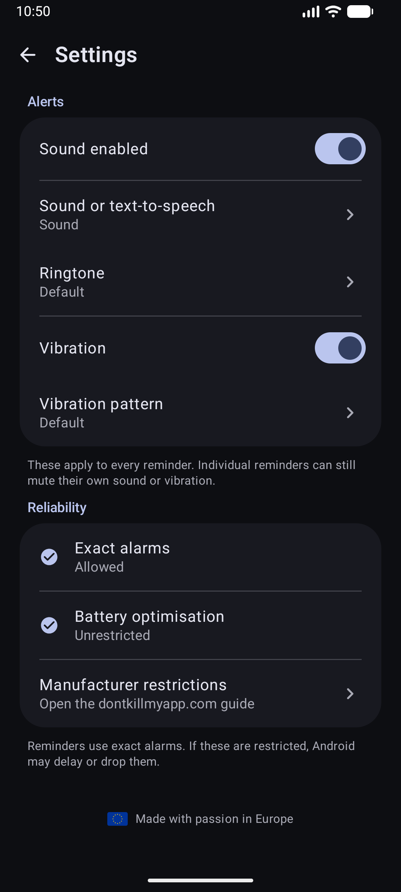

<!-- LOGO SECTION (Replace logo.png with your actual icon path if you have one, or remove the line) -->

# reReminder

**The Loop that keeps you in the Loop.**

A powerful, open-source Android application for recurring reminders.  
Perfect for workouts, medication, hydration, productivity techniques (Pomodoro), or simply keeping track of time.

<!-- BADGES START -->

<!-- BADGES END -->

 

<!-- DOWNLOAD BUTTONS START -->

 

<!-- DOWNLOAD BUTTONS END -->

---

## 🚀 Overview

**reReminder** is designed for one simple purpose: **Reliability**. Whether you need a chime every 5 minutes to correct your posture, a vibration to sip water, or a voice telling you the time, reReminder handles it without draining your battery or invading your privacy.

It runs in the background, wakes up exactly when it needs to, and goes back to sleep. Simple.

## ✨ Key Features

*   **⏱️ Precise Intervals:** Set reminders to repeat every X minutes or hours.
*   **🗣️ Text-to-Speech (TTS):** Let the app *speak* your custom message or the current time so you don't have to look at your phone.
*   **📳 Haptic Control:** Fully customizable vibration patterns.
*   **🔔 Sound Selection:** Choose from system notification sounds or keep it silent.
*   **🌙 Dark Mode:** Fully supported system-wide Dark Mode for night-time usage.
*   **⏯️ Instant Control:** Easy Start/Stop functionality with immediate feedback.
*   **🔋 Efficient:** Lightweight architecture ensuring minimal battery impact.

## 🛡️ Privacy & Philosophy

We believe your phone belongs to **you**.

*   ✅ **100% Open Source**
*   ✅ **No Ads**
*   ✅ **No Tracking / Analytics**
*   ✅ **No Unnecessary Permissions**
*   ✅ **Offline First**

## 📸 Screenshots

  <!-- Replace specific paths with your actual screenshot paths -->
  <table>
    <tr>
      <td align="center"><b>Light Mode</b></td>
      <td align="center"><b>Dark Mode</b></td>
      <td align="center"><b>Settings</b></td>
    </tr>
    <tr>
      <td></td> <!-- ADD SCREENSHOTS TO A 'docs' FOLDER -->
      <td></td>
      <td></td>
    </tr>
  </table>

## 🛠️ Installation

### Option 1: Google Play Store
[Google Play](https://play.google.com/store/apps/details?id=com.olaf.rereminder)

### Option 2: F-Droid
[F-Droid](https://f-droid.org/de/packages/com.olaf.rereminder/)

### Option 3: Manual APK (GitHub)
1. Go to the [Releases](https://github.com/ProfessorQuantumUniverse/reReminder/releases) page.
2. Download the latest `.apk` file.
3. Install it on your Android device (you may need to allow installation from unknown sources).

## 🤝 Contributing

Contributions are what make the open-source community such an amazing place to learn, inspire, and create. Any contributions you make are **greatly appreciated**.

1. Fork the Project
2. Create your Feature Branch (`git checkout -b feature/AmazingFeature`)
3. Commit your Changes (`git commit -m 'Add some AmazingFeature'`)
4. Push to the Branch (`git push origin feature/AmazingFeature`)
5. Open a Pull Request

## 📄 License

Distributed under the MIT License. See `LICENSE` for more information.

---

Made with ❤️ for the Android Community

